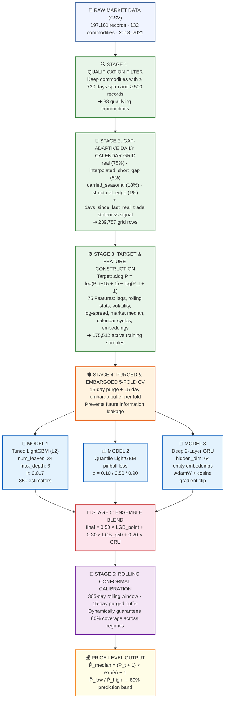
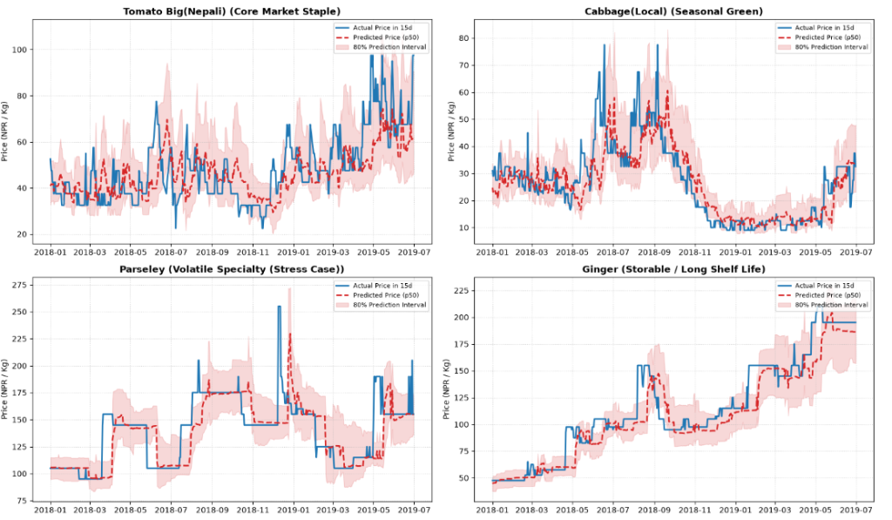
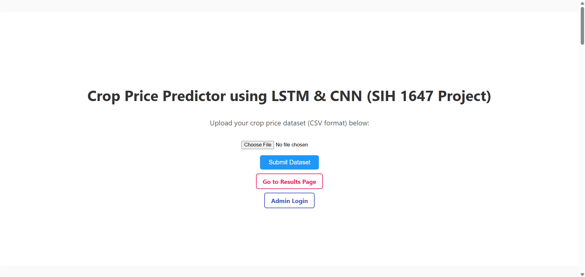
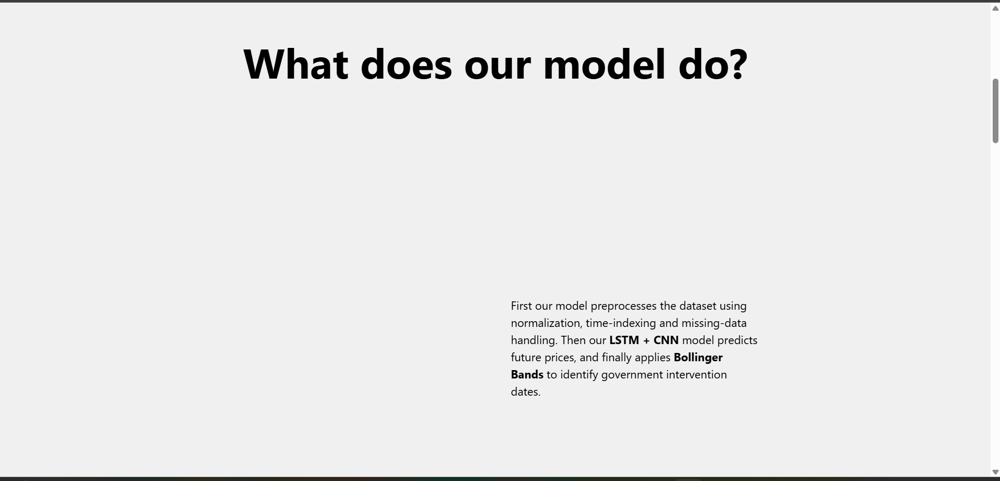
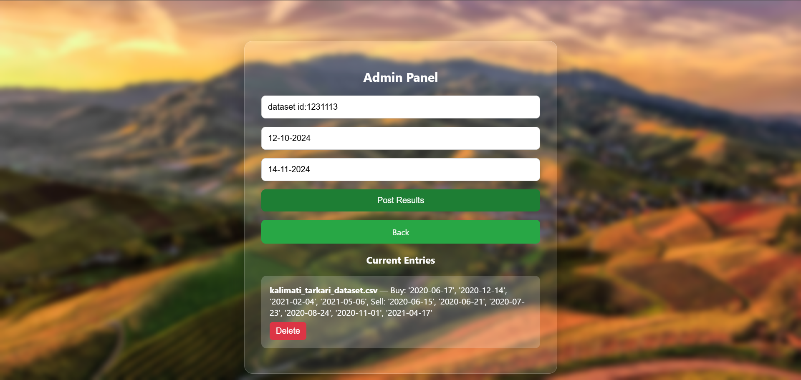
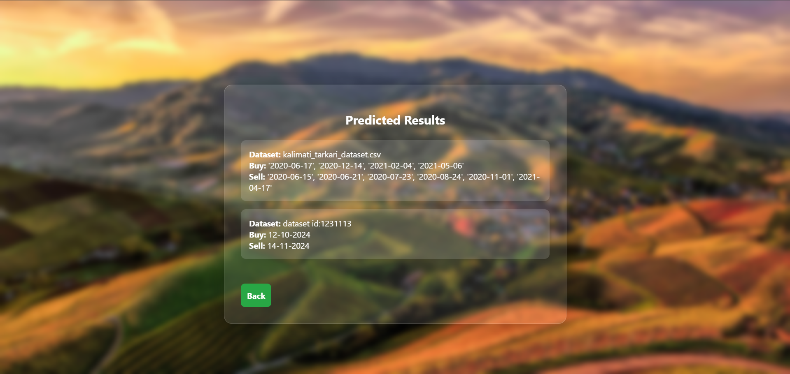

# Commodity Price Forecasting System — SIH 2024

A unified machine learning system that forecasts **15-day-ahead wholesale vegetable prices** across **83 agricultural commodities**, paired with a web platform for publishing and viewing results. Developed by **Team Xebec's Crew** for Smart India Hackathon (SIH) 2024.

The forecasting engine builds **one global ensemble model** that learns shared market dynamics, seasonal supply cycles, and cross-commodity price relationships — then delivers both a **point price prediction** and a **calibrated 80% prediction interval** (price range) for every commodity.

Prototype Website: https://sih-project-self.vercel.app/

---

## Problem Statement

**Domain:** Agriculture & Market Linkage  
**Challenge:** Predict future wholesale vegetable prices 15 days ahead using historical market data, quantify forecast uncertainty with calibrated prediction intervals, and publish the results through an accessible web interface — supporting farmers, buyers, and government agencies in making data-driven market decisions.

---

## Project Structure

```
SIH_PROJECT/
│
├── notebooks/
│   └── commodity_price_forecasting_pipeline.ipynb   # Complete self-contained ML pipeline
│
├── src/                          # Source code modules
│   ├── feature_engineering.py    # Full feature pipeline (B1–B6, gap-adaptive imputation)
│   └── ...
│
├── data/
│   └── kalimati_tarkari_dataset.csv   # Raw wholesale market dataset
│
├── reports/
│   └── figures/                  # Visualizations and forecast demonstration plots
│
├── Webpage/
│   ├── api/                      # Flask backend
│   │   ├── app.py
│   │   └── requirements.txt
│   └── frontend/                 # React frontend
│       ├── src/
│       └── public/
│
├── LICENSE
├── README.md
└── requirements.txt              # Python ML dependencies
```

---

# AI-ML Section: Commodity Price Forecasting Pipeline

---

## Goal

Build a **single unified forecasting system** that predicts wholesale vegetable prices **15 days into the future** across **83 agricultural commodities** — delivering not just a point estimate but a calibrated **80% prediction interval** (price range) so that farmers, buyers, and government agencies can make risk-informed market decisions.

The system uses one global model that learns shared market dynamics across all commodities, rather than 83 fragile per-commodity models. This allows even low-data commodities to benefit from the broader market's statistical structure.

---

## Pipeline Architecture Overview

The forecasting pipeline is organized into 6 sequential stages:

1. **Data Ingestion & Qualification** — Load raw wholesale market records and filter for commodities with sufficient trading history (≥2 years, ≥500 records), yielding 83 qualifying series.

2. **Gap-Adaptive Imputation** — Place all commodities on a uniform daily calendar grid. Classify and fill missing days using gap-size-aware logic:
   - *Short gaps* (≤7 days, weekends/holidays): smooth log-linear interpolation
   - *Seasonal gaps* (8–90 days): flat forward-fill to avoid fabricating false trends
   - *Structural edges*: alignment padding (excluded from training)

3. **Feature Engineering** — Extract 75 indicators capturing price momentum (lagged returns), volatility dynamics (rolling standard deviations), intraday spread signals, a cross-sectional market-wide median return, calendar/seasonal cycles, and learned commodity identity embeddings.

4. **Multi-Loss Diverse Ensemble** — Train three complementary models and blend their predictions:
   - **Tuned LightGBM** (L₂ point estimator) — captures non-linear feature interactions
   - **Quantile LightGBM** (pinball loss, p50 median) — robust to heavy-tailed price shocks
   - **2-Layer GRU** (deep recurrent network) — captures sequential temporal dependencies

5. **Rolling Conformal Calibration** — Wrap raw quantile intervals in a dynamically recalibrated conformal wrapper (365-day rolling window) to guarantee exactly 80% coverage across changing market regimes.

6. **Price Inversion & Deployment** — Convert log-return predictions back to actual wholesale currency prices (NPR / Kg) for human-readable forecast output.

---

## Pipeline Flow Diagram



---

## Benchmark Results

### Global System Performance (All 83 Commodities, Out-of-Fold)

| Metric | Baseline (Naive Persistence) | Production Ensemble | Improvement |
|---|---|---|---|
| **Price MAE** (Rs / Kg) | Rs 11.98 | **Rs 11.54** | +3.6% |
| **Price RMSE** (Rs / Kg) | Rs 27.06 | **Rs 24.53** | +9.4% |
| **MAPE** | 17.1% | **16.3%** | +0.8pp |
| **80% Interval Coverage** | N/A | **79.97%** | ✓ Nominal 80% |

### Per-Commodity Validation (6 Representative Archetypes)

| Commodity | Role / Cluster | Price MAE (Rs) | MAPE (%) | 80% Coverage |
|---|---|---|---|---|
| **Tomato Big(Nepali)** | Core Staple (High Co-movement) | Rs 9.42 | 19.7% | 79.8% |
| **Cabbage(Local)** | Seasonal Green (Low-Variance) | Rs 5.88 | 22.1% | 77.9% |
| **Parseley** | Volatile Specialty (Stress Case) | Rs 17.13 | 10.4% | 82.3% |
| **Ginger** | Storable / Long Shelf Life | Rs 10.48 | 10.3% | 80.9% |
| **Lemon** | Data Volume Floor (~500 rows) | Rs 3.43 | 8.9% | 88.8% |
| **Carrot(Local)** | Median-Volume Reference | Rs 10.76 | 18.0% | 80.3% |

### Regime Stability (Performance Across Market Conditions)

| Regime Window | Avg Price MAE (Rs) | Avg Coverage |
|---|---|---|
| **Calm Baseline (2014–2015)** | Rs 8.57 | 80.8% |
| **Shock Regime (2016–2018)** | Rs 7.23 | 82.5% |
| **Recent Volatility (2019–2021)** | Rs 13.51 | 81.8% |

---

## Forecast Demonstration

Actual wholesale prices (blue) vs. predicted median (red dashed) with 80% prediction intervals (shaded band) across four commodity archetypes spanning 2018–2019:



---

## Dataset

**Kalimati Tarkari Dataset** (publicly available) containing:

* **197,161** historical wholesale price records
* **132** commodity types (83 qualifying after statistical filtering)
* Daily market observations from **2013 to 2021**
* Fields: Date, Commodity, Unit, Minimum, Maximum, Average price

Path: `data/kalimati_tarkari_dataset.csv`

---

## How to Run the ML Pipeline

### 1. Install Dependencies

Requires Python 3.10+:

```bash
pip install -r requirements.txt
```

### 2. Run the Complete Pipeline Notebook

```bash
jupyter notebook notebooks/commodity_price_forecasting_pipeline.ipynb
```

The notebook is self-contained — it executes top-to-bottom, from raw data loading through feature engineering, model training, ensemble blending, conformal calibration, and visual per-commodity evaluation.

---

# Web Interface Section

## Overview

The system is built with a **React frontend** and a **Flask + MongoDB backend**. It enables users to:

- Upload crop price datasets
- View predicted **intervention dates** based on LSTM+CNN model forecasts
- Allow admins to **post, update, and delete** results from a secure admin panel
- Store all uploaded datasets and results dynamically in MongoDB

**Note**: The LSTM+CNN model runs externally and is not part of this deployed web app. Instead, the web platform serves as a service interface for client interaction and result display.

## Features

- Upload datasets via a public user dashboard
- Secure admin login with session-based authentication
- Real-time admin panel to post, update, and delete results
- Dynamic result storage using MongoDB
- RESTful API endpoints to handle results and dataset uploads
- Mobile-responsive design using CSS
- Deployed frontend (React) via **Vercel**
- Deployed backend (Flask + MongoDB) via **Render**

## Tech Stack

- **Frontend**: React, CSS, React Router
- **Backend**: Flask, MongoDB (via PyMongo), Gunicorn (for deployment), Python-dotenv
- **APIs**: REST APIs for all client-server communication
- **Database**: MongoDB Atlas
- **Deployment**:
  - React: Vercel
  - Flask: Render
 
## Webpage Screenshots:
### Main Dashboard View (Upload Dataset in csv format and links to other pages)


### Scroll down to find FAQ's


### Admin login page


### Admin dashboard (to update delete results in real-time)


### Results page (public, entries can be edited from the admin page only)


## Setup Instructions

### Backend (Flask)

```bash
cd Webpage/api
pip install -r requirements.txt
```
-Create a .env file in Webpage/api with the following content:
 MONGO_URI=your_mongodb_connection_string
-Then start the development server:
```bash
python app.py
```
### Frontend (React)
```bash
cd Webpage/frontend
npm install
npm start
```

---

## Conclusion

This system demonstrates that a **single global ensemble** trained across 83 agricultural commodities can deliver reliable 15-day-ahead price forecasts with calibrated uncertainty bounds. By combining gradient-boosted trees (for feature interactions), quantile regression (for tail robustness), and a deep recurrent network (for sequential memory), the ensemble achieves consistent improvements over naive persistence baselines across all market conditions — from calm periods to volatile price shocks. The rolling conformal calibration layer ensures that the 80% prediction intervals remain trustworthy over time, making the system suitable for real-world deployment where both point accuracy and risk quantification matter for agricultural market decision-making.

---

## Authors & Team

**Xebec's Crew – SIH 2024**
Team Members:
* Mridul Chouhan *(Team Leader & Backend Developer)*
* Anik Panja *(Lead ML Engineer)*
* Arkadip Ghara *(ML Engineer)*
* Siddharth Patel *(Finance Analyst & pitch deck creator)*
* Satyabratta Biswal *(Frontend Developer)*

---

## License

This project is licensed under the [MIT License](LICENSE).

---

## Contact

For any questions or collaborations:
* 📧 [MridulChouhan@gmail.com](mailto:strangemridul@gmail.com)
* 📧 [anikpanja362@gmail.com](mailto:anikpanja362@example.com) 

---
